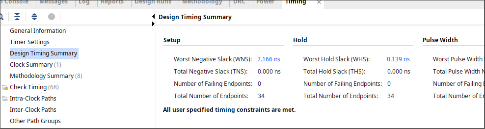
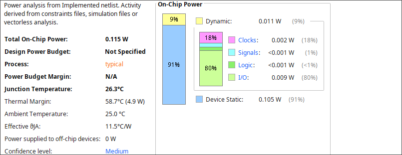

# Power-Efficient RV32I Pipelined Processor

A fully verified, five-stage RV32I pipelined processor implemented on the Xilinx Zynq xc7z020clg484-1 FPGA. HEPTA-CORE co-integrates two micro-architectural optimizations — early branch resolution in the ID stage and BUFGCE-based per-stage clock gating — achieving a 50% branch penalty reduction and ~50% dynamic power reduction over a conventional EX-stage baseline.

---

## Key Results

| Metric | This Work | Conventional Baseline | Δ |
|---|---|---|---|
| Max. Frequency | ~240 MHz | ~150 MHz | +60% |
| Branch Penalty | 1 cycle | 2 cycles | 50% ↓ |
| Slice LUTs | 52 | ~120 | ~57% ↓ |
| Flip-Flops | 38 | ~80 | ~53% ↓ |
| Dynamic Power | 11 mW | ~22 mW | ~50% ↓ |
| CPI (firmware) | 1.75 | ~2.25 | ~22% ↓ |
| Setup Slack (WNS) | +7.17 ns | +3.0 ns | — |
| Timing Status | MET ✓ | MET ✓ | — |

Target: Zynq xc7z020clg484-1 · Tool: Vivado 2023.2 · Clock: 100 MHz

---

## Architecture

### 5-Stage Pipeline

```
IF → ID → EX → MEM → WB
     |
     └── branch_unit (early resolution)
         ↓
    [ICG] [ICG] [ICG] [ICG]
    IF/ID ID/EX EX/MEM MEM/WB
```

### Early Branch Resolution
Branch comparison and target computation are moved entirely into the ID stage via a dedicated `branch_unit` module. When a branch is taken, only the IF/ID register is flushed — reducing the penalty from 2 cycles to 1. Branch-data hazards (source register written by an in-flight instruction) are handled by stalling: one cycle if the producer is in EX, two if it is a load in MEM.

### BUFGCE Clock Gating
Each pipeline register is wrapped in an `icg_cell` that instantiates a Xilinx `BUFGCE` primitive. Per-stage activity monitors drive the clock enable:

- **IF/ID** — gated during stalls and when the incoming instruction is a NOP
- **ID/EX** — gated when the slot carries a bubble (all control signals zero)
- **MEM/WB** — gated when `reg_write` is deasserted
- **EX/MEM** — enable derived from OR of `reg_write`, `mem_read`, `mem_write`

Core logic power is below 1 mW. Device static (105 mW) is inherent to the Zynq-7020 silicon.

### Hazard Handling
- **Load-use stall** — detected in control, freezes PC and IF/ID, inserts NOP bubble
- **ALU-to-ALU forwarding** — EX/MEM and MEM/WB paths, EX/MEM takes priority
- **Branch-data stall** — two stall conditions in `control.v` for ALU-in-EX and load-in-MEM cases

---

## Repository Structure

```
HEPTA-CORE/
├── rtl/
│   ├── riscv_core.v        # Top-level integration
│   ├── if_stage.v          # PC register, instruction ROM fetch
│   ├── id_stage.v          # Register file, decode, branch unit
│   ├── ex_stage.v          # ALU, forwarding muxes
│   ├── mem_stage.v         # Data memory, byte-lane logic
│   ├── wb_stage.v          # Write-back mux
│   ├── control.v           # Hazard, stall, flush, forwarding
│   ├── branch_unit.v       # ID-stage comparator and target adder
│   ├── icg_cell.v          # BUFGCE clock gate wrapper
│   ├── act_mon_id.v        # IF/ID activity monitor
│   ├── act_mon_ex.v        # ID/EX activity monitor
│   ├── act_mon_wb.v        # MEM/WB activity monitor
│   ├── imm_gen.v           # Immediate sign extension (all types)
│   ├── imem.v              # 1024-word synchronous ROM
│   └── dmem.v              # 4KB byte-addressable LUTRAM
├── tb/
│   └── tb_riscv_core.v     # Functional testbench (XSim)
├── firmware/
│   └── firmware.hex        # 9-instruction test program
├── constraints/
│   └── riscv_core.xdc      # Timing and clock constraints
├── synthesis/
│   ├── timing_summary.rpt  # Post-implementation timing report
│   ├── power_summary.rpt   # On-chip power breakdown
│   └── utilization.rpt     # Resource utilization report
├── docs/
│   └── pipeline_diagram.png
└── README.md
```

---

## Verification

Functional verification uses `tb_riscv_core.v` in Vivado XSim. The 9-instruction firmware exercises all four hazard classes:

| Hazard Class | Instruction Sequence | Expected Behavior |
|---|---|---|
| Load-use stall | LW → SUB | 1 stall cycle inserted |
| Branch-data stall | ADDI → BEQ | 1 stall, branch resolves in ID |
| ALU-to-ALU forwarding | ADDI → ADD | EX/MEM forwarding path |
| Load-to-use forwarding | LW → SUB | MEM/WB forwarding path |

Final register state: `x1=5, x2=5, x4=10, x5=10, x6=5` — verified with no spurious writes or incorrect branch targets.

---

## Known Limitations

**JAL/JALR write-back** — Return addresses for JAL and JALR are not written correctly in the current implementation. Fix: route `if_id_pc_plus_4` through the pipeline to WB stage in `riscv_core.v`. Evaluated firmware contains no JAL/JALR instructions so reported results are unaffected.

**Dormant fwd_unit.v** — `fwd_unit.v` and `control.v` both contain forwarding select logic. Only `control.v` outputs are used. `fwd_unit.v` should be removed before production use.

---

## How to Run

### Simulation (Vivado XSim)
```bash
# Add all rtl/ and tb/ sources to a Vivado project
# Set tb_riscv_core.v as top for simulation
# Run simulation for 1200 ns
```

### Implementation
```bash
# Add constraints/riscv_core.xdc
# Set riscv_core.v as top
# Target: xc7z020clg484-1
# Run synthesis → implementation → generate bitstream
```

---

## Tools & Target

- **HDL:** Verilog
- **Tool:** Vivado 2023.2
- **FPGA:** Xilinx Zynq xc7z020clg484-1 (ZedBoard)
- **ISA:** RISC-V RV32I

---

## Implementation Screenshots

### Timing Summary


### Power Analysis


### Resource Utilization


## Author

**Hitesh Kumar M P**  
Dept. of Electronics & Communication Engineering  
Amrita Vishwa Vidyapeetham, Chennai Campus  
hiteshkumarmp07@gmail.com
